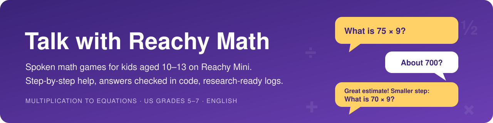
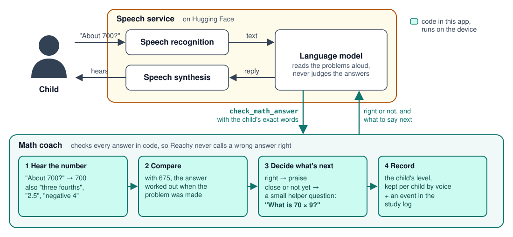
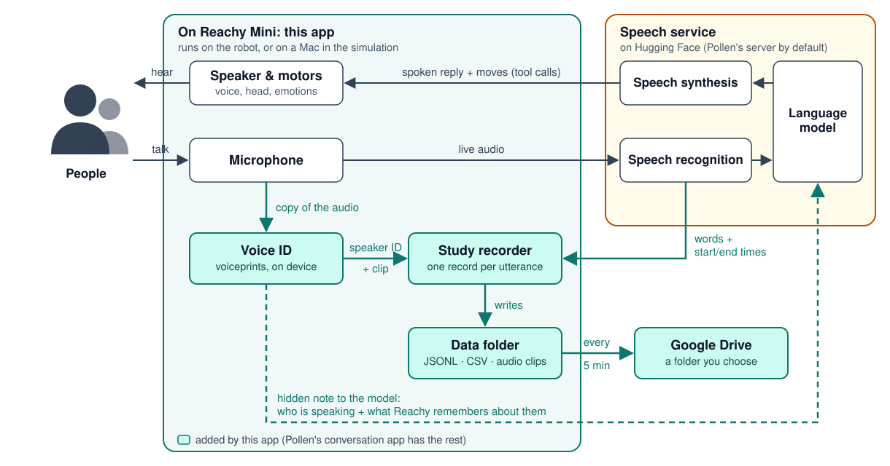

<p align="center">
  
</p>

<p align="center">
  <a href="#what-a-game-sounds-like">A game</a> ·
  <a href="#the-five-games">The five games</a> ·
  <a href="#how-a-game-works">How a game works</a> ·
  <a href="#what-the-app-does">What it does</a> ·
  <a href="#how-reachy-checks-an-answer">How answers are checked</a> ·
  <a href="#math-topics-and-levels">Topics and levels</a> ·
  <a href="docs/LEARNING_DESIGN.md">Research behind the design</a> ·
  <a href="#what-gets-recorded">What gets recorded</a> ·
  <a href="#privacy-and-responsibility">Privacy</a> ·
  <a href="#try-it">Try it</a> ·
  <a href="#built-with">Built with</a> ·
  <a href="#disclaimer">Disclaimer</a>
</p>

**Talk with Reachy Math** is an app for [Reachy Mini](https://github.com/pollen-robotics/reachy_mini), a small robot by Pollen Robotics. Reachy plays spoken math games with children aged about 10 to 13 (US grades 5 to 7), in English. The child picks a game: a story adventure, fixing Reachy's mistakes, number riddles, a closest guess game, or quick math. Reachy reads each problem aloud, listens to the child's answer, and, when the answer is not right yet, helps with small step-by-step questions. Every answer is checked in code, not by the language model, so Reachy never calls a wrong answer right.

Each game is built on findings from research on learning and motivation, such as how stories, choice, and explaining mistakes help children learn math. [docs/LEARNING_DESIGN.md](docs/LEARNING_DESIGN.md) explains each design choice and lists the studies behind it.

The app is built on **[Talk with Reachy](https://github.com/renkaima/talk_with_reachy)**, so it also keeps a research record of each conversation: what was said, when it was said, and who said it, recognized by voice. It was built for research studies.

> [!IMPORTANT]
> **This app records.** By default it saves what everyone near the robot says, an audio clip of each utterance, and a voiceprint of each voice. It is meant for children, so a parent, teacher, or researcher should set it up and is responsible for getting consent; see [Privacy and responsibility](#privacy-and-responsibility).

## What a game sounds like

An example of the "fix my mistakes" game; Reachy's exact wording varies.

> **Reachy:** Hi! I'm Reachy, a little robot who loves playing math games. Do you want to fix my mistakes, or try some number riddles?<br>
> **Child:** Fix your mistakes!<br>
> **Reachy:** Yay, I need your help! Here is how it works. I did some math, but I made mistakes. I tell you my answer. You find the right answer. Then you tell me what I did wrong! Take your time, and say help if you get stuck. Ready?<br>
> **Child:** Ready!<br>
> **Reachy:** Can you check my work? I tried 1 half plus 1 third. I added the top numbers and the bottom numbers. I got 2 fifths. What is the real answer?<br>
> **Child:** Two fifths?<br>
> **Reachy:** I got that too! But I think one of my steps has a mistake. Can you check my work again?<br>
> **Child:** Hmm… I don't know.<br>
> **Reachy:** That's okay, it's a tricky one. Let's work it out together. Let's make the bottom numbers the same. 6 works for both. 1 half is how many sixths?<br>
> **Child:** Three.<br>
> **Reachy:** Yes! 1 third is how many sixths?<br>
> **Child:** Two. Oh, so it's 5 sixths!<br>
> **Reachy:** You fixed it: 1 half plus 1 third is 5 sixths! My mistake was adding the bottom numbers. They must be the same before we add. Ready for the next one?

## The five games

At the start, and after every round of five problems, Reachy lets the child pick one of two games. Over a few rounds, every game comes up. The first time a child plays a game, Reachy explains how to play in a few short sentences; when the child plays it again, Reachy gives a one-line reminder.

| Game | What happens | Math practiced |
|---|---|---|
| **Story adventure** | Reachy tells a five-part story about something the child likes, such as space, dogs, or soccer. Each part needs one problem solved to go on: "Oh no, we are stuck! To get going, we need 3 fourths of our 24 moon rocks." | multiplication, division, a fraction of a number, percent off, order of operations |
| **Fix my mistakes** | Reachy shows its own work with a common mistake in it. The child finds the real answer, and Reachy asks them what it did wrong. | fractions, decimals, order of operations, negative numbers, multiplication, percent, equations |
| **Number riddles** | "I'm thinking of a number between 20 and 30. It is odd. It is in the 3 times table. What is my number?" A wrong guess hears which clue it does not fit and gets another try. | even and odd numbers, times tables, digits |
| **Closest guess** | "6 boxes have 49 moon rocks in each. About how many moon rocks is that?" The child guesses, then Reachy, and the closer guess wins. Reachy then shares the rounding trick. | estimating by rounding |
| **Quick math** | Plain problems, five on one topic, then the next topic. | the eight topics [below](#math-topics-and-levels) |

The story and guessing games use what the child likes: Reachy can pick from seven themes (space, dogs, soccer, dinosaurs, pizza, the ocean, and video games), and the app remembers each child's theme for next time.

## How a game works

<p align="center">
  
</p>

A session is a series of rounds. Each round is one game the child picked, five problems long, and the next round starts with a new choice. Before a child's first round of a game, Reachy explains how to play. Within a round, Reachy asks "Ready for the next one?" after each problem and reads the next problem when the child says yes. It offers a break or other games between rounds.

## What the app does

**For the child**

- Reachy starts right away: its hello ends with a choice of two games. The first time a child plays a game, Reachy explains how to play. Problems then come in rounds of five, and after each problem Reachy asks whether the child is ready for the next one.
- If the child talks about something else, Reachy answers briefly and brings them back to the game. If the child finds it boring, Reachy offers another game instead of stopping. It stops only when the child clearly says so, and invites them back a few minutes later.
- Everything the app gives Reachy to read uses short sentences (at most 15 words) and words that most 4th graders know, plus math words from school such as "fraction". A test checks every game rule, problem, helper question, and explanation against the Dale-Chall list of familiar words.
- Reachy talks at 85% of its speech service's speed, with the same pitch, so that children can follow.
- When an answer is not right, Reachy first gives the child time to think again, without a hint. After a second try, or as soon as the child asks for help, Reachy breaks the problem into small helper questions instead of giving the answer.
- Problems get harder or easier as the child goes, separately for each topic and each child.

**For the researcher**

- Every problem, answer, helper question, and level change is logged with its time, the game, and the child's speaker ID.
- Each child's levels and favorite theme are kept between sessions, found by their voice.
- Everything Talk with Reachy records is recorded too: timed transcripts, speaker IDs by voice, an audio clip per person utterance, and robot actions. The robot uploads it all to a Google Drive folder every five minutes.

## How Reachy checks an answer

<p align="center">
  
</p>

1. **Reachy reads a problem** that the app made, with its answer already worked out.
2. **The child answers aloud.** The speech service turns the answer into text, and the language model passes the child's exact words to the app's math coach.
3. **The math coach reads the number** from those words: digits, number words ("seventy-two"), decimals, fractions ("three fourths"), mixed numbers, and negatives.
4. **The coach compares it with the stored answer and decides what comes next.** A right answer gets praise. A first answer that is not right yet gets "Not quite yet" and another try, and a second one gets a small helper question; a guess within 10 percent is praised as a good estimate. Each game adds its own reply: in a riddle, Reachy names the clue a wrong guess does not fit; when a child repeats Reachy's own mistake, Reachy says it got that too and asks the child to check again; in the closest guess game, any number counts as a guess, and the coach works out whose guess was closer. After the last helper question, Reachy says the whole answer, and explains it if the child's last answer was not right either.
5. **The coach records the result and keeps the game going.** It writes every answer to the study log and, when a problem is finished, updates the child's level. The language model then says what the coach decided and asks whether the child is ready for the next problem; when the child says yes, the coach hands over the next problem of the round.

## Math topics and levels

Eight topics follow the US Common Core standards for grades 5 to 7. Each topic has three levels. The story adventure and "fix my mistakes" draw on these topics at the child's level in each. Number riddles and the closest guess game have three levels of their own.

| Topic | Level 1 | Level 2 | Level 3 | How Reachy helps |
|---|---|---|---|---|
| Multiplication | 2-digit × 1-digit | 2-digit × 2-digit | 3-digit × 2-digit | breaks a number into tens and ones |
| Division | 2–3 digits ÷ 1 digit | 3 digits ÷ 2 digits | 3–4 digits ÷ 2 digits | takes away a round number of groups first |
| Fractions | add, same bottom number | add or subtract, different bottom numbers | fraction of a number; fraction × fraction | makes the bottom numbers the same |
| Decimals | add or subtract tenths | add or subtract hundredths | multiply | thinks of the numbers as money |
| Percentages | 10, 25, 50 percent | 5, 20, 30, 40, 60, 75 percent | 12, 15, 35, 45, 65, 85 percent | starts from 50, 25, or 10 percent |
| Negative numbers | add | subtract a negative | multiply | uses a number line and the sign rules |
| Order of operations | a + b × c | (a + b) × c − d | a × b − c ÷ d | does one operation at a time |
| Equations | x ± a = b | a × x = b | a × x + b = c | treats x as a secret number |

In stories, the numbers stay small enough to work out while listening; for example, story multiplication at level 2 is a 2-digit number times a 1-digit number.

| Game level | Level 1 | Level 2 | Level 3 |
|---|---|---|---|
| Number riddles | a number between two tens 10 apart; clues: even or odd, the 3, 4, or 5 times table, the sum of its digits | 20 apart; the 3, 4, 6, 7, or 9 times table, the last digit | 30 apart, up to 150; the 6, 7, 8, 9, 11, or 12 times table |
| Closest guess | about 2-digit × 1-digit | about 2-digit × 2-digit | about 3-digit × 2-digit |

**How levels change.** Each child starts every topic and game at level 1. Three problems in a row answered right on the first try (in the closest guess game: three close guesses in a row) move the child up one level. Two problems in a row in which Reachy had to give away an answer move the child down one level. A problem solved on the second try, or with help with every helper question answered right, leaves the level as it is.

## A study session, step by step

| When | Who | What happens |
|---|---|---|
| **Before** | Researcher | Installs the app on the robot from the Reachy Mini Control app, signs the robot in to Google Drive once, and enrolls each child's voice (about 20 seconds of speech per child). |
| **During** | Children | Reachy lets them pick a math game, plays rounds of five problems at each child's level, and chats in between. |
| **After** | Researcher | Opens the Google Drive folder *Talk with Reachy Math*. It holds the transcripts with all math events, the audio clips, and each child's math progress. The same files stay on the robot. |

## How the recording works

<p align="center">
  
</p>

- **Voice ID runs on the device.** The app cuts each person utterance out of a copy of the microphone audio and computes a voiceprint with NVIDIA's TitaNet-S speaker model, run locally with [sherpa-onnx](https://github.com/k2-fsa/sherpa-onnx). The best-matching known voice gives the speaker ID, which also tells the math coach whose level to use.
- **Reachy is told who is speaking** through a note that is not spoken aloud, with the person's name and what Reachy remembered about them.
- **The study recorder** writes one record per utterance (words, start and end times, speaker ID, audio clip) and every math event into the data folder, and **the uploader** copies the folder to Google Drive every five minutes.

[Talk with Reachy's README](https://github.com/renkaima/talk_with_reachy#how-it-works) explains these parts in more detail.

## What gets recorded

Everything goes into one data folder, `~/talk_with_reachy_math_data/` on the robot (or on the Mac, in the simulation):

```
talk_with_reachy_math_data/
├── transcripts/<robot>_<date-time>_<id>.jsonl   one file per app run, with all math events
├── transcripts/<same name>.csv                  the same timeline as a spreadsheet
├── audio/<same name>/<seq>_<speaker ID>.wav     one clip per person utterance
├── people/library.json                          voiceprints of all known voices
├── people/<speaker ID>/memory.v1.json           what Reachy remembers about each child
└── people/<speaker ID>/math_progress.json       the child's levels, favorite theme, and games explained
```

The math events are `math_game_explained` (Reachy told a child how to play a game), `math_problem` (the game and theme, the problem, its topic and level, the answer, Reachy's own wrong answer or guess, and its place in the round), `math_answer` (what the child said, the number read from it, whether it was right, which helper question it answered, whether Reachy asked the child to try again or started the helper questions, and, depending on the game, the clue a riddle guess broke or who won a closest guess), `math_level_change`, and `math_practice_stopped`. A problem from the closest guess game and the child's answer look like this (each is one line in the file, spread out here):

```json
{
  "session_id": "9f2c…",
  "type": "event",
  "event": "math_problem",
  "time": "2026-10-03 10:15:36.002-04:00",
  "elapsed_s": 35.191,
  "problem_id": "M006",
  "asked_to": "P01",
  "game": "closest_guess",
  "theme": "space",
  "skill": "closest_guess",
  "level": 1,
  "standards": "4.OA.3, 5.NBT.5",
  "text": "6 boxes have 49 moon rocks in each. About how many moon rocks is that? Just guess, then I will guess too.",
  "answer": "294",
  "reachy_answer": "370",
  "source": "generated",
  "round": 2,
  "position": 1
}
{
  "session_id": "9f2c…",
  "type": "event",
  "event": "math_answer",
  "time": "2026-10-03 10:15:42.118-04:00",
  "elapsed_s": 41.307,
  "problem_id": "M006",
  "answered_by": "P01",
  "asked_to": "P01",
  "heard": "Maybe three hundred?",
  "parsed": "300",
  "step": null,
  "seconds_since_asked": 6.1,
  "attempt": 1,
  "reachy_guess": "370",
  "winner": "child",
  "close": true,
  "correct": true,
  "outcome": "first_try"
}
```

[STUDY_SETUP.md](STUDY_SETUP.md#math-practice) describes every field and event.

## Privacy and responsibility

Talk with Reachy Math is a research tool, and it records by default. For everyone who speaks near the robot, it saves the words, the times, every math answer, an audio clip of each utterance, and a voiceprint, which some laws treat as biometric data. These files stay on the device. They leave it only for the Google Drive of the person who signs the robot in to Google; the maintainer of this app never receives them. As in Pollen's app, the microphone audio is also streamed to the speech service on Hugging Face, and with this app the hidden notes also send it people's names and what Reachy remembers about them.

Talk with Reachy Math is meant for children. It should be set up by a parent, teacher, or researcher, who is also responsible for any consent that recording children requires, such as a parent's consent.

Whoever installs and runs the app chooses to record, and is responsible for:

- telling everyone near the robot that they are being recorded, and getting their consent;
- following the laws that apply where the robot is used, such as rules on recording conversations and on biometric data;
- keeping the recordings safe, and deleting a person's data when they ask ([how](STUDY_SETUP.md#managing-voices)).

To record less, set `TALK_WITH_REACHY_MATH_SAVE_AUDIO=0` (no audio clips), `TALK_WITH_REACHY_MATH_VOICE_ID=0` (no voiceprints), or `TALK_WITH_REACHY_MATH_LOGGING=0` (no study records at all); see [Settings](STUDY_SETUP.md#settings). To keep the audio on your own hardware, run your own speech service ([connection modes](docs/ORIGINAL_README.md#hugging-face-connection-modes)).

The app is provided "as is", without warranty of any kind; see the [Disclaimer](#disclaimer).

## Try it

**In the simulation, without a robot.** Start the simulation in the Reachy Mini Control app on a Mac, install Talk with Reachy Math, and talk through the Mac's microphone. The app writes transcripts, speaker IDs, audio clips, and math events to `~/talk_with_reachy_math_data` on the Mac. To test the Google Drive upload as well, sign the Mac in once with `bash deploy/google_dry_run.sh` ([details](STUDY_SETUP.md#5-sign-in-to-google-drive-one-time-per-device)).

**On a Reachy Mini.** Open the app store in the Reachy Mini Control app, search for *Talk with Reachy Math*, and click **Install**. The app records on the robot from the first conversation. Google Drive upload works only for Google accounts that the maintainer has added as testers, so on other robots the files stay on the device. [STUDY_SETUP.md](STUDY_SETUP.md#setup-in-order) lists every setup step for a study, from enrolling children to checking the upload.

**From source, for developers.** The [developer reference](docs/ORIGINAL_README.md) covers installing from source, configuration, and command-line options; here the command is `talk-with-reachy-math`. The Google client secret is not in this repository, so a copy run from source keeps its study files on the device.

## Good to know

- **A misheard number is checked as heard.** The coach checks what the speech service transcribed. The audio clip of each answer is saved, so answers can be checked by ear.
- **The language model decides when to call the math coach.** If it ever answers by itself instead, no `math_answer` event is logged for that problem; the transcript still shows what was said.
- **Check voice ID before relying on it,** especially with children's voices: the voice-matching thresholds come from a check on clean recordings of six speakers and have not been validated on children's voices or in a noisy room ([details](STUDY_SETUP.md#voice-identification)).
- **Separate from Talk with Reachy.** This app has its own data folder, Google Drive folder, Google sign-in, and voice library, and its Python package `talk_with_reachy_math` installs next to the other apps on the same robot.
- **Math can be switched off** with the setting `TALK_WITH_REACHY_MATH_PRACTICE=0`.
- **Reachy's voice is slowed in the app.** The speech service has no speed setting, so the app plays its audio at 85% speed. `TALK_WITH_REACHY_MATH_SPEECH_SPEED` changes this, and `1` plays the voice unchanged.
- **The research behind the games is not an evaluation of this app.** The studies in [docs/LEARNING_DESIGN.md](docs/LEARNING_DESIGN.md) tested other games, tutors, and robots, mostly on screens and with other age groups. Whether these games help children learn is a question for a study.

## Built with

Talk with Reachy Math adds new code (the math games, the answer checking, the word check, and the slower voice) to the projects below. Their authors do not maintain or endorse this app. The full list of dependencies is in [pyproject.toml](pyproject.toml) and [uv.lock](uv.lock).

| Project | By | What it does in this app | License |
|---|---|---|---|
| [reachy_mini_conversation_app](https://github.com/pollen-robotics/reachy_mini_conversation_app) | Pollen Robotics | The app this one is a fork of: voice conversation, tools, robot movement, and the settings page | Apache 2.0 |
| [Talk with Reachy](https://github.com/renkaima/talk_with_reachy) | Renkai Ma | Study logging, voice ID, per-person memory, and Google Drive upload | Apache 2.0 |
| [reachy_mini](https://github.com/pollen-robotics/reachy_mini) | Pollen Robotics | Robot control and the app framework of the Reachy Mini Control app | Apache 2.0 |
| [reachy_mini_dances_library](https://github.com/pollen-robotics/reachy_mini_dances_library) | Pollen Robotics | Dances and emotion moves | see its repository |
| Speech service on Hugging Face | Pollen Robotics (hosted service) | Speech recognition, the language model, and speech synthesis | the service's terms |
| [sherpa-onnx](https://github.com/k2-fsa/sherpa-onnx) | Next-gen Kaldi team | Runs the speaker model on the device | Apache 2.0 |
| [TitaNet-S](https://catalog.ngc.nvidia.com/orgs/nvidia/teams/nemo/models/titanet_small) | NVIDIA NeMo | Voiceprints for voice ID | see NVIDIA's model card |
| [huggingface_hub](https://github.com/huggingface/huggingface_hub) | Hugging Face | Hugging Face sign-in for the speech service, and tool Spaces | Apache 2.0 |
| [openai-python](https://github.com/openai/openai-python) | OpenAI | Client library for the realtime connection to the speech service | Apache 2.0 |
| [MCP Python SDK](https://github.com/modelcontextprotocol/python-sdk) | Model Context Protocol | Remote tools such as web search and weather | MIT |
| [httpx](https://github.com/encode/httpx) | Encode | HTTP requests, including the Google Drive upload | BSD 3-Clause |
| [MSAL for Python](https://github.com/AzureAD/microsoft-authentication-library-for-python) | Microsoft | OneDrive sign-in (currently switched off) | MIT |
| [audiotsm](https://github.com/Muges/audiotsm) | Muges | Plays Reachy's voice more slowly without changing its pitch (WSOLA) | MIT |
| [textstat](https://github.com/textstat/textstat) | textstat contributors | The Dale-Chall word list for the word check (tests only) | MIT |

The math games follow the US [Common Core State Standards for Mathematics](https://www.thecorestandards.org/Math/) for grades 5 to 7, and their design draws on the studies listed in [docs/LEARNING_DESIGN.md](docs/LEARNING_DESIGN.md).

## Disclaimer

- **Research prototype, provided as is.** Talk with Reachy Math is a research tool released under the Apache 2.0 license, "as is", without warranty of any kind. The maintainer is not liable for any use of it; see sections 7 and 8 of the [license](LICENSE).
- **Not affiliated.** This app is not affiliated with or endorsed by Pollen Robotics, Hugging Face, NVIDIA, OpenAI, Google, or the authors of any project listed above. "Reachy Mini" names the robot that the app runs on.
- **Not a substitute for teaching.** The app is not a curriculum, a certified tutor, or an assessment of a child's ability. Its games have not been evaluated with children; the studies in [docs/LEARNING_DESIGN.md](docs/LEARNING_DESIGN.md) tested other systems.
- **AI can make mistakes.** The app checks every answer in code, but Reachy's spoken replies come from a language model and can still be wrong, off topic, or unsuitable, and speech recognition can mishear an answer. An adult should supervise children who use the app.
- **Children's data.** By default the app records voices, words, and voiceprints. Whoever installs it is responsible for getting consent and for following the laws on recording children and on biometric data where it is used; see [Privacy and responsibility](#privacy-and-responsibility). A research study that uses the app needs its own ethics approval.
- **Third-party services.** Microphone audio is streamed to a speech service on Hugging Face, and study files can be uploaded to Google Drive. The terms and privacy policies of those services apply.

## Credits and license

- Maintained by Renkai Ma ([@renkaima](https://github.com/renkaima)).
- The changes from Talk with Reachy are the commits after commit `624b78b`, and the changes from Pollen's app are the commits after upstream commit `5eb39ed`.
- License: Apache 2.0, see [LICENSE](LICENSE). The projects listed under [Built with](#built-with) keep their own licenses.
